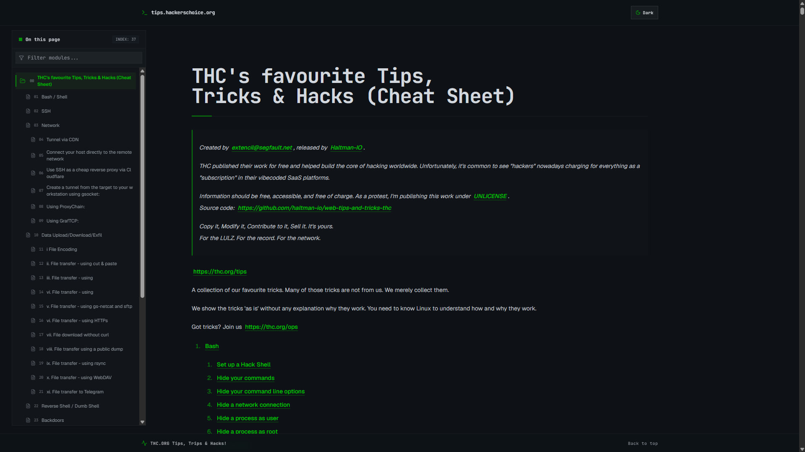

# THC Tips, Tricks & Hacks Cheat Sheet

Static web mirror for the THC tips, tricks, and hacks cheat sheet.

Original content repository: [hackerschoice/thc-tips-tricks-hacks-cheat-sheet](https://github.com/hackerschoice/thc-tips-tricks-hacks-cheat-sheet)

Web source code: [haltman-io/web-tips-and-tricks-thc](https://github.com/haltman-io/web-tips-and-tricks-thc)

## Demo

## Available domains

- [https://tips.haltman.org](https://tips.haltman.org/)
- [https://tips.mishandle.org](https://tips.mishandle.org/)
- [https://tips.kerberoast.org](https://tips.kerberoast.org/)
- [https://tips.haltman.io](https://tips.haltman.io/)
- [https://tips.polkit.org](https://tips.polkit.org/)
- [https://tips.hackerschoice.org](https://tips.hackerschoice.org/)
- [https://tips.extencil.me](https://tips.extencil.me/)
- [https://tips.503.lat](https://tips.503.lat/)
- [https://tips.metasploit.io](https://tips.metasploit.io/)
- [https://tips.abin.lat](https://tips.abin.lat/)
- [https://tips.revil.org](https://tips.revil.org/)
- [https://tips.johntheripper.org](https://tips.johntheripper.org/)
- [https://tips.cobaltstrike.org](https://tips.cobaltstrike.org/)
- [https://tips.lockbit.io](https://tips.lockbit.io/)
- [https://tips.pwnd.lat](https://tips.pwnd.lat/)

## Notice

Created by extencil@segfault.net, released by [Haltman-IO](https://haltman.io/).

THC published their work for free and helped build the core of hacking worldwide. Unfortunately, it's common to see "hackers" nowadays charging for everything as a "subscription" in their vibecoded SaaS platforms.

Information should be free, accessible, and free of charge. As a protest, I'm publishing this work under [UNLICENSE](https://unlicense.org/).

Copy it, Modify it, Contribute to it, Sell it. It's yours.

For the LULZ. For the record. For the network.
